# Hybrid Predictive Framework for Robot-Assisted Environmental Pollution Analysis

A modular Python pipeline that forecasts **PM2.5 air pollution** using a **Hybrid ARIMAX + LSTM** model and drives an **autonomous robot decision system** for adaptive environmental monitoring across 12 Beijing air-quality stations.


---

## 🔍 Overview

Accurate short-term PM2.5 forecasting is critical for public health and smart-city response. This framework combines the strengths of classical statistics and deep learning:

| Model | Role |
|---|---|
| **ARIMAX (1, 0, 1)** | Captures linear temporal dynamics with exogenous weather/pollutant features, after seasonal decomposition (period = 4380 h ≈ half-year) |
| **LSTM (2 × 16 units)** | Learns non-linear patterns from all 27 hourly features (11 sensors + 16 one-hot wind directions) |
| **Hybrid ARIMA-LSTM** | ARIMAX forecast + LSTM correction of ARIMAX residuals → best of both worlds |

The predictions then feed a **robot decision module** — a 4-state machine (`PATROL → MONITOR → ALERT → EMERGENCY`) with adaptive sampling rates (1 / 4 / 12 / 60 samples per hour), a GPS movement simulator with a battery model, and a multi-sensor cascade that activates additional sensors as pollution severity rises.

## 🏗️ Pipeline Stages

1. **Data loading** — 12 station CSVs → hourly DataFrames, 27 features each
2. **EDA** — distributions, correlations, seasonality
3. **ARIMAX** — seasonal removal, ADF stationarity test, exogenous feature selection (p < 0.05)
4. **LSTM** — 2-layer LSTM, dropout 0.2, early stopping (patience 10)
5. **Hybrid ARIMA-LSTM** — residual correction
6. **Model comparison** — MAE / RMSE / R² across all stations
7. **Robot decision module** — 4-state machine on predicted PM2.5
8. **Spatial hotspot analysis** — station-level pollution mapping
9. **Multi-sensor cascade simulation** — severity-triggered sensor activation
10. **Animations & video export** — robot dashboard and cascade animations
11. **Final summary** — metrics, reports, and saved outputs

## 📈 Results

Test-set performance averaged across all 12 stations (hourly PM2.5, 20% hold-out):

| Model | MAE ↓ | RMSE ↓ | R² ↑ |
|---|---|---|---|
| ARIMAX | 26.62 | 39.82 | 0.765 |
| LSTM | 17.41 | 31.50 | 0.907 |
| **Hybrid ARIMA-LSTM** | **11.20** | **18.56** | **0.949** |

The hybrid model cuts MAE by **58%** vs. ARIMAX and **36%** vs. LSTM alone.

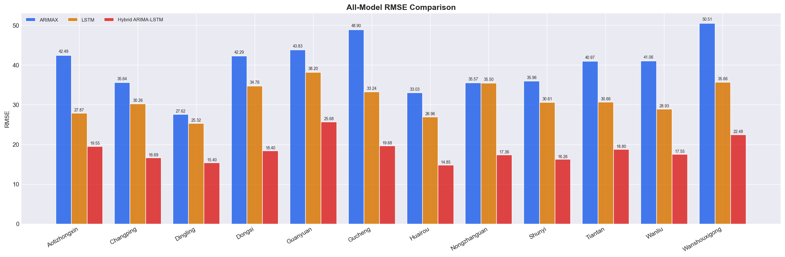

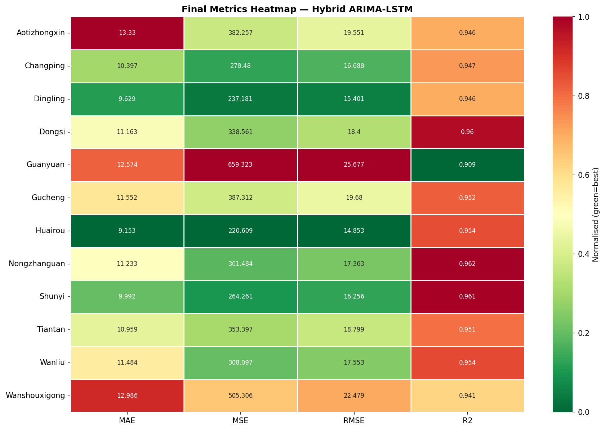

**Hybrid prediction vs. ground truth (Tiantan station):**

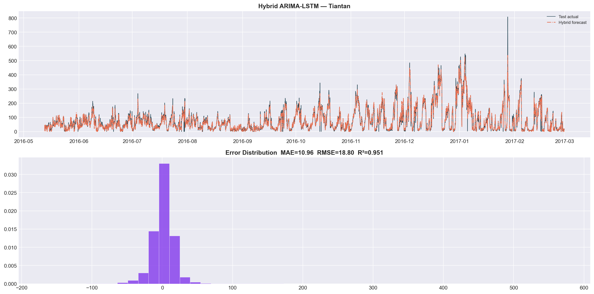

**Robot monitoring performance** (test period, all stations): **91.2%** hazard detection accuracy, **0.69 days** average response time, **100%** station coverage.

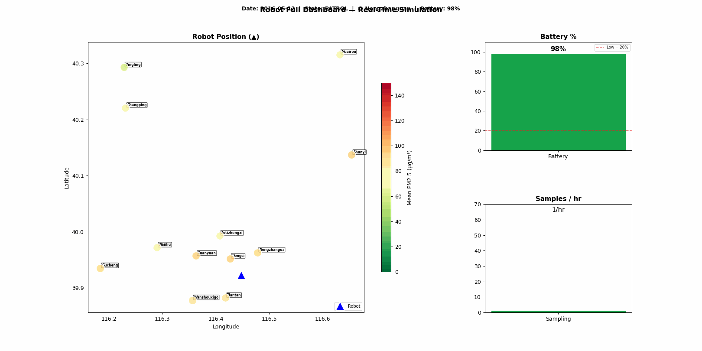

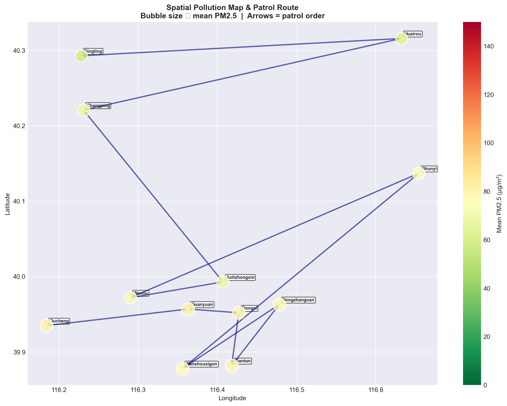

<details>
<summary>More figures</summary>

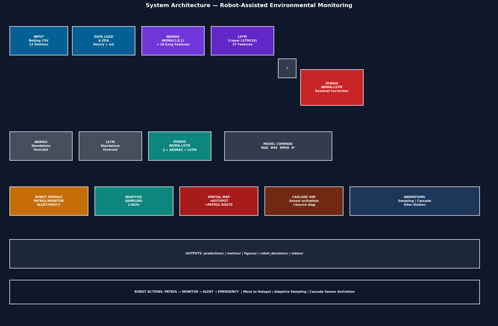

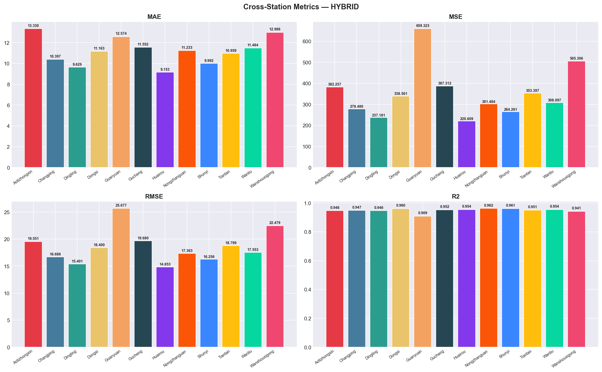

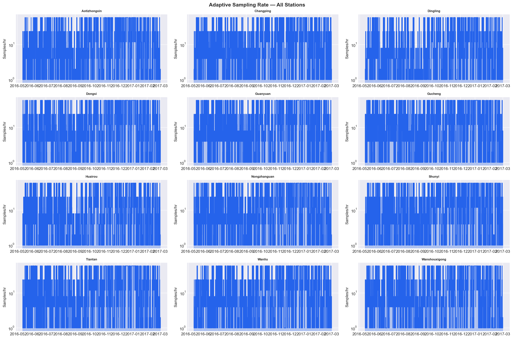

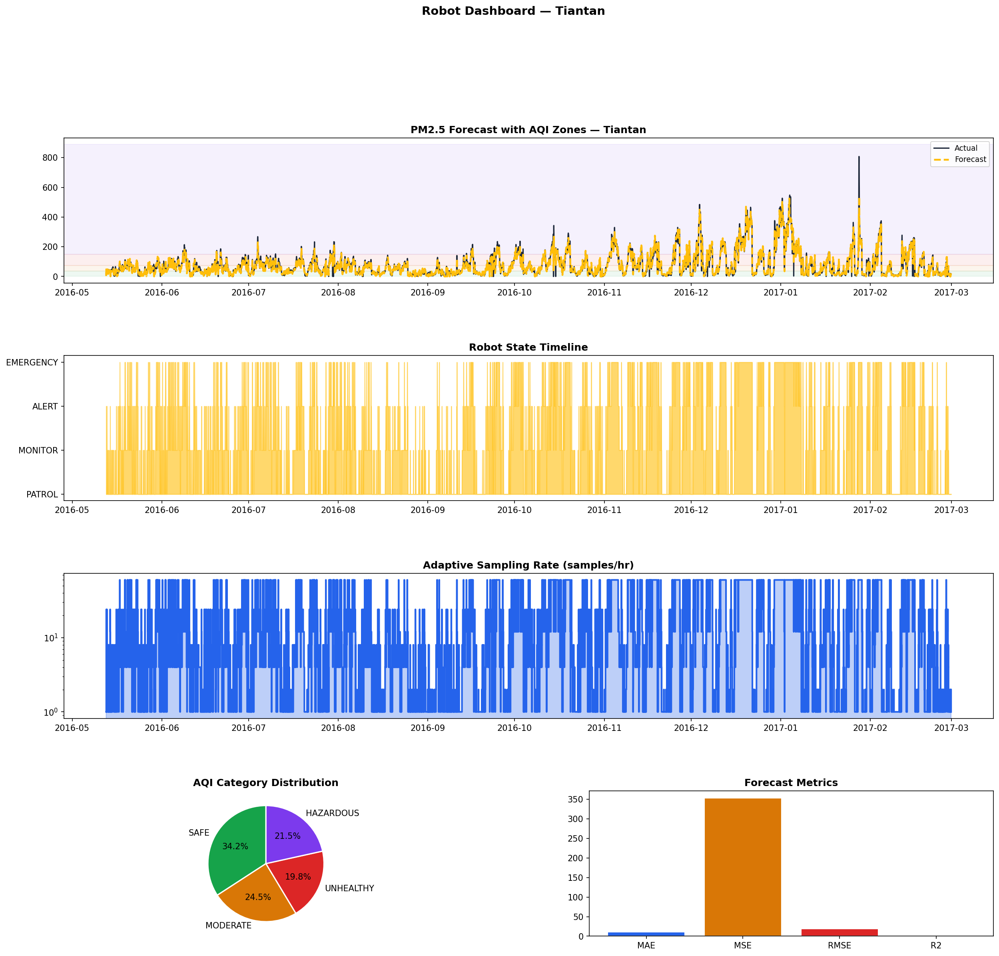

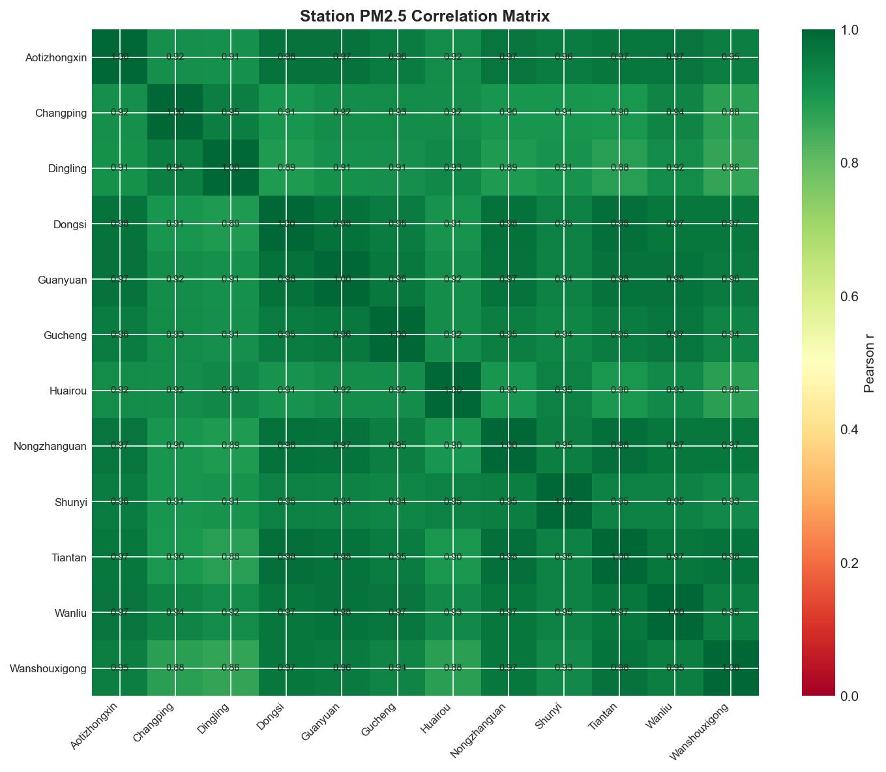

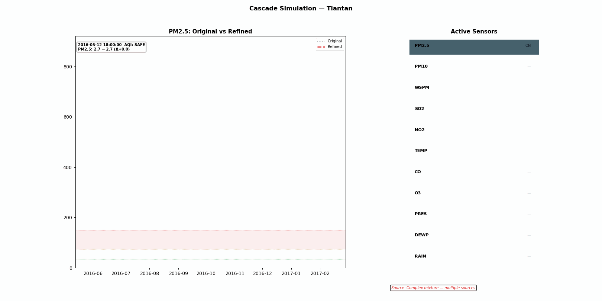

</details>

## 🤖 Robot Decision System

WHO-based daily PM2.5 thresholds (µg/m³):

| State | PM2.5 range | Sampling rate | Extra sensors activated |
|---|---|---|---|
| 🟢 SAFE | 0 – 35 | 1 / h | — |
| 🟡 MODERATE | 35 – 75 | 4 / h | PM10, WSPM |
| 🔴 UNHEALTHY | 75 – 150 | 12 / h | PM10, SO2, NO2, TEMP |
| 🟣 HAZARDOUS | > 150 | 60 / h | all 10 auxiliary sensors |

The movement simulator patrols the 12 stations (base: **Tiantan**) with realistic constraints: movement speed 0.05°/step, battery costs for moving/sampling, idle recharge, and a low-battery return threshold of 20%.

## 📂 Project Structure

```
hybrid_pm25_model/
├── main.py                  # Entry point — runs the full 11-stage pipeline
├── requirements.txt
├── config/
│   └── settings.py          # All hyperparameters, paths, thresholds, palettes
├── data/
│   └── loader.py            # Beijing Multi-Site dataset loading & preprocessing
├── models/
│   ├── arima_model.py       # ARIMAX with seasonal decomposition + ADF testing
│   └── bilstm_model.py      # LSTM training + Hybrid ARIMA-LSTM residual correction
├── evaluation/
│   └── reconstruction.py    # Hotspot analysis, cascade simulation, metrics, reports
├── robot/
│   └── decision_module.py   # 4-state decision machine + movement/battery simulator
├── utils/
│   └── helpers.py           # Seeding, metrics, figure saving
└── visualization/
    └── plots.py             # EDA, dashboards, model comparison, animations
```

## 📊 Dataset

[Beijing Multi-Site Air-Quality Data](https://archive.ics.uci.edu/dataset/501/beijing+multi+site+air+quality+data) (UCI Machine Learning Repository)

- **Period:** 2013-03-01 → 2017-02-28 (hourly)
- **Stations:** 12 monitoring sites across Beijing
- **Features:** PM2.5, PM10, SO2, NO2, CO, O3, TEMP, PRES, DEWP, RAIN, WSPM + wind direction

Download and extract the CSVs into a folder named `PRSA_Data_20130301-20170228/` placed **next to** the project folder (or edit `DATA_DIR` in `config/settings.py`).

## 🚀 Getting Started

```bash
git clone https://github.com/UrwaMughal7/Hybrid-Predictive-Framework-for-Robot-Assisted-Environmental-Pollution-Analysis.git
cd Hybrid-Predictive-Framework-for-Robot-Assisted-Environmental-Pollution-Analysis

pip install -r requirements.txt
python main.py
```

All outputs are written to `results/` — organized into `eda/`, `arima/`, `training/`, `predictions/`, `metrics/`, `figures/`, `baseline/`, `robot_decisions/`, `videos/`, `movement/`, and `energy/`.

## 🔁 Reproducibility

Every run is fully deterministic: fixed seed (42), `TF_DETERMINISTIC_OPS`, `TF_CUDNN_DETERMINISTIC`, and pinned hash seeds are set in `config/settings.py`.

## 👤 Author

**Urwa Mughal** — [@UrwaMughal7](https://github.com/UrwaMughal7)
